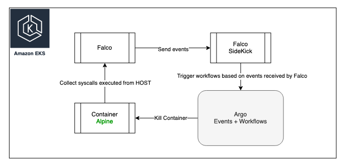

## Architecture



## Requirements
- terraform
- helm
- kubectl

## How to start

Please configure your kubectl to point to your cluster, you can check that by running *kubectl get pods -A*

You can simply deploy the solution by using make
```
make install
```

After demonstration is done, delete resources. Please note this doesn't delete infrastructure resources in cloud providers, this template assumes you already have a cluster running.
```
make destroy
```

## Testing the solution

As showed in the architecture diagram, the solution consists in some very basic steps:
- Falco deployed with rules to verify multiple different syscalls
- Falco Sidekick to perform event notifications to a variety of sources, in our case a simple webhook provided by Argo events.
- Argo events deployed to provide webhook and overall event orchestration
- Argo workflow integrated with events to take actions, in our case a pod deletion.

In order to simulate that workflow, simply run and attach to any pod.
```
kubectl run alpine1 --namespace default --image=alpine --restart='Never' -- sh -c "sleep 36000"&& kubectl exec -it alpine1 -n default -- sh
```

After few seconds, pod should receive a deletion signal from kubelet and die with status 137:
```
pod/alpine1 created
/ # ls
bin    dev    etc    home   lib    media  mnt    opt    proc   root   run    sbin   srv    sys    tmp    usr    var
/ # command terminated with exit code 137
```

## Verifying and adding new rules

Default rules are deployed in the following paths:
```
/etc/falco/falco_rules.yaml
/etc/falco/rules.d
```

You can quickly check default rules by using this command:
```
kubectl exec -it -n falco -c falco $(kubectl get pods -l app.kubernetes.io/name=falco -n falco -o name | awk -F'/' '{print $2}'
) -- cat /etc/falco/falco_rules.yaml
```

Instead of changing default rules, the best practice is to add new files and configure new rules in that file.

In order to add new files and make sure Falco reads it, you should perform the following steps:
- Under rules/rules-configmap.yaml, add a new file under data object.
- Note the file will be created with exact same name under /etc/falco/custom in your falco container
- Add it under falco.rules_file[]
- Reinstall your application by using either make install or make deploy-falco

## Setup CloudTrail on AWS

Follow the instructions on the provided terraform code to deploy AWS resources.

The unique parameter needed is the queue name, which defaults to ffc. In order to change that name, export *TF_VAR_name* env var before applying:
```
export TF_VAR_name=ffc
```

If you have changed the name, go to your falco-values and change falco.plugins[] array. 

We already have a item in the list called cloudtrail using the default ffc name, if you changed it, simply change this line:
```
  plugins:
    - name: cloudtrail
      library_path: libcloudtrail.so
      init_config: ""
      open_params: "sqs://<QUEUE_NAME>"
```
